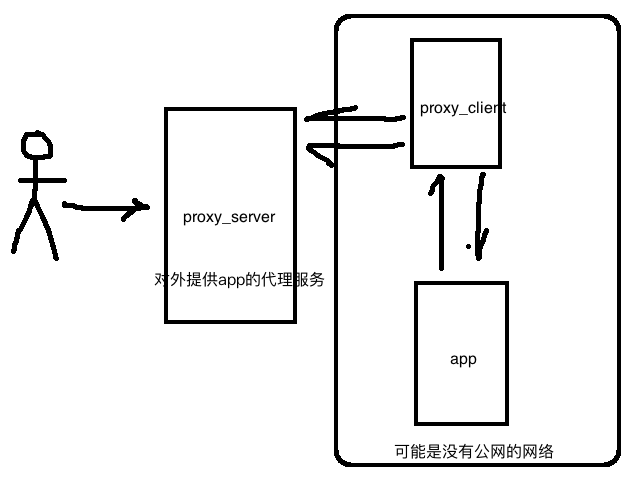
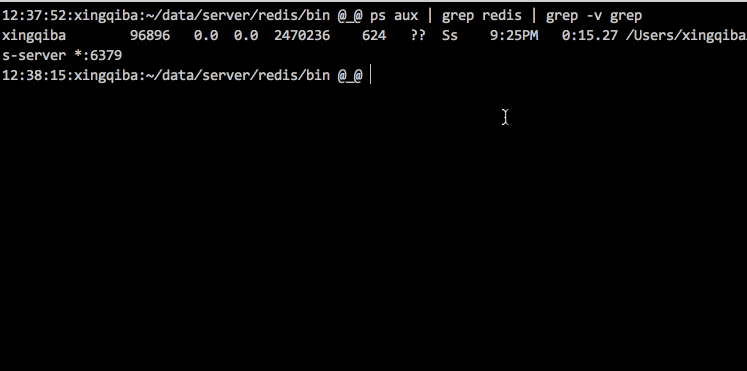

# tcpproxy



假设我们希望有一台机器A(ip 192.168.1.101)要开放端口6379给用户访问，但可能实际情况是用户无法直接访问到A(ip 192.168.1.101), 但却有一台机器B(ip 192.168.1.100) 可以开放一些其他端口给用户访问，为了让用户通过B(ip 192.168.1.100)能访问到A(ip 192.168.1.101)上6379端口，基于swoole实现的Tcpproxy解决了这个问题！ 当然你可以联想到我们家里的内部机器是在外网无法访问的，可正好你有一台云服务器，所以我们可以通过Tcpproxy实现外部访问你家里的内网应用, 说到这里你可以完全把它当成内网花生壳的功能. 按照上面描述的情况，配置我们的服务选项后如下

```php
//sproxy_server使用
//守护进程模式
$proxy_conf['daemon'] = 1;
//开放地址
$proxy_conf['host'] = '192.168.1.100';
//开放端口
$proxy_conf['ports'] = [
	[9999, 7777, 0],  //开放给用户端口，内部转发端口，是否http
];

//sproxy_client使用
$sproxy_conf = [
	'daemon'      => 1,
	'process_num' => 10,
	//指定代理服务地址+端口
	'agent' => [
		'host' => '192.168.1.100',
		'port' => 7777,
	],
	//指定目标app地址+端口
	'apps' => [
		'host' => '192.168.1.101',
		'port' => 6379,
	],
];
```

在A,B服务器分别运行
```
php sproxy_client.php
php sproxy_server.php
```

赶紧部署试试吧

##演示 



##模拟内网花生壳功能时使用要点
* 需要一台有公网ip运行proxy_server.php开放给用户访问
* 在你的内网运行proxy_client.php来代理你的应用

##为了调试更方便，对于内内网无php&swoole环境的，我们提供了sproxy，功能同proxy_client.php
```c
make
#单以多进程模式运行
./sproxy_process -s 127.0.0.1:6677 -t 127.0.0.1:6379 -c 10 -d
#或以多进程多线程模式运行
./sproxy_thread -s 127.0.0.1:6677 -t 127.0.0.1:6379 -c 10 -d
```
* -d 指定以守护进程模式运行
* -s 指定proxy_server.php内部地址和端口
* -t 指定需要代理app运行地址和端口
* -c 指定开启进程数量

更多疑问请+qq群 233415606 or [website http://www.hnphper.com](http://www.hnphper.com)
